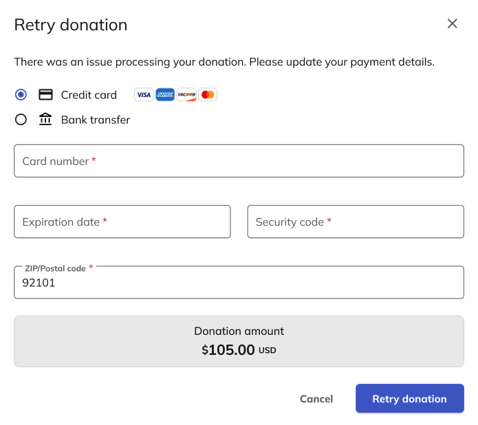

---
hide:
  - navigation
---

# Intro to the Supporter Center

The Supporter Center is Classy’s hub for donors, fundraisers, and event attendees, where you can manage your contact information, recurring donations, and receipts.

When you log in to Classy and visit your organization’s supporter center, you can view your online giving statistics, manage your recurring donations and fundraising pages, and resend receipts to your email address.

## Access the Supporter Center

To access the Supporter Center:

1. [Log in to Classy](https://www.classy.org/profile)
2. Under Organizations I’m Supporting, choose an organization you support

Then, you’ll land in that organization’s Supporter Center.

## Manage fundraising pages and teams

If you have any fundraising pages or teams with that organization, you can find them under Fundraising. Select **View** or **Manage** to visit or edit these pages.

Learn more about managing your [fundraising page](https://support.classy.org/s/article/how-to-edit-a-fundraising-page) or [team](https://support.classy.org/s/article/how-to-manage-your-team-as-a-team-captain).

## View donation history and resend receipts

To view your donation history, select **Donation History** in the menu. Then, you can search for any specific donation and select **Resend receipt** to automatically send a receipt to the email address in your settings.

## Manage recurring donations

To manage your recurring donations, select **Recurring donations** in the menu. Then, select **Manage donation** under the donation you wish to edit.

Under Donation details, you can adjust:

- Donation amount
- Whether to cover transaction fees
- Frequency
- Next donation date
- End date

Under Payment details, you can update the credit card on file or switch to bank transfer.

### Retry a recurring donation

When you miss a recurring donation for any reason, you can update your payment details and retry the donation. To retry a missed recurring donation, go to your donation and select **Retry**. Once you update your payment details, select **Retry Donation** to process your recurring donation.

### Cancel a recurring donation

If you wish, you can cancel your recurring donation. Simply go to your recurring donation and select **Cancel donation**. You’ll also have the option to pause your monthly donation for up to three months instead.

## Update contact information

To update your contact information, select **Settings** in the menu. Then, select **Edit** to change your name, email address, phone number, and address.

