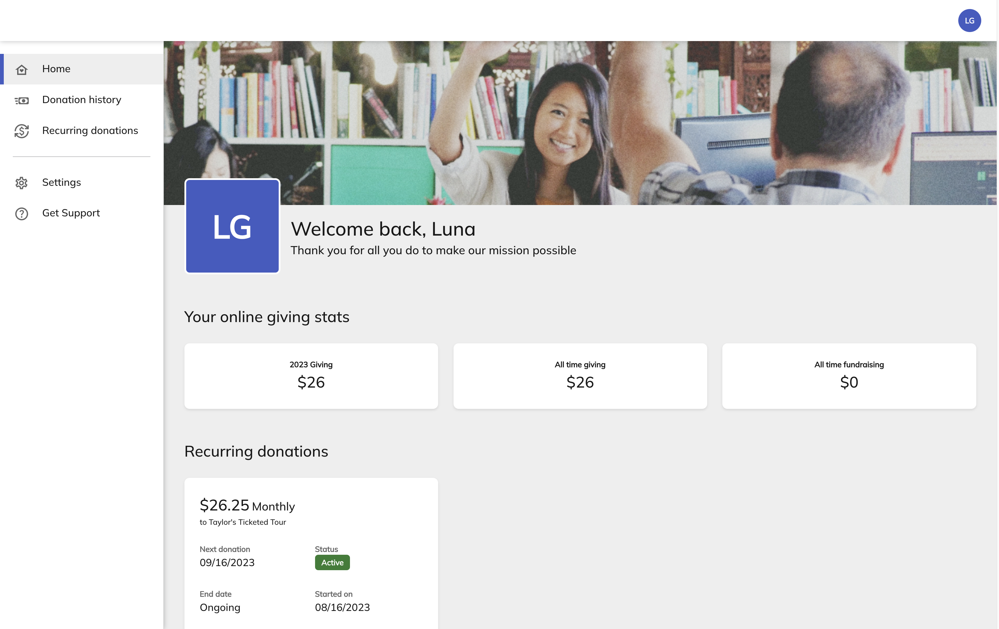
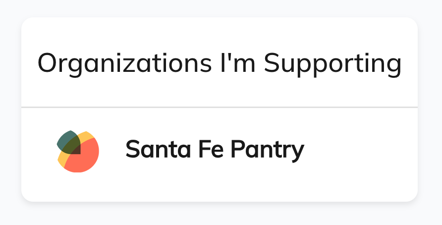
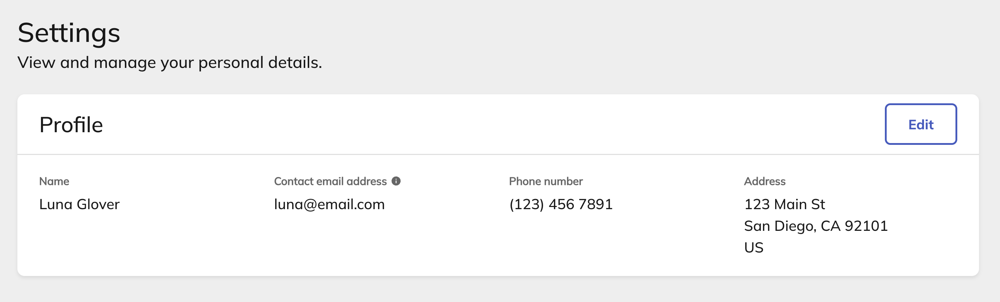

# Intro to the Supporter Center

The Supporter Center is Classy’s new hub for supporters, where they can manage their contact information, recurring donations, and receipts. Also, admins can customize this experience by adding a hero image and a thank you message and adjusting your organization’s preferences.

Share this [supporter article](for-supporters.md) to help your supporters get acquainted with their new hub.

!!! example "Want to participate?"

    <a href="https://learn.classy.org/supporter-center-beta-sign-up.html">Sign up</a> to gain access to the Supporter Center.

## Customize the Supporter Center

To customize an organization’s Supporter Center in Classy:

1. In your account, select **Settings**
2. Select **Supporter Center Settings**

Then, select **Edit** to change the Hero Section and your Preferences. In this section, you can:

- Add a hero image
  - For best quality, use a 1184px by 265px image
- Add a headline message
- Choose whether to display donation statistics
  - These include: current-year giving, all-time giving, and all-time fundraising
- Choose whether to allow supporters to download annual summaries of their receipts

## Use the Supporter Center

Supporters who log in to Classy and visit your organization’s supporter center can view their online giving statistics, manage their recurring donations and fundraising pages, and resend their receipts.

### Access the Supporter Center

To access the Supporter Center:

1. [Log in to Classy](https://www.classy.org/profile)
2. Under Organizations I’m Supporting, choose an organization

Then, you’ll land in the organization’s Supporter Center.

### Manage fundraising pages and teams

If you have any fundraising pages or teams, you can find them under Fundraising. Select **View** or **Manage** to visit or edit these pages.

### View donation history and resend receipts

To view your donation history, select **Donation History** in the menu. Then, you can search for any specific donation and select **Resend receipt** to automatically send a receipt to the email address in your settings.

### Manage recurring donations

To manage your recurring donations, select **Recurring donations** in the menu. Then, select **Manage donation** under the donation you wish to edit.

Under Donation details, you can adjust:

- Donation amount
- Whether to cover transaction fees
- Frequency
- Next donation date
- End date

Under Payment details, you can update the credit card on file or switch to bank transfer.

#### Cancel a recurring donation

If you wish, you can cancel your recurring donation. Simply go to your recurring donation and select **Cancel donation.** You’ll also have the option to pause your monthly donation for up to three months instead.

### Update contact information

To update your contact information, select **Settings** in the menu. Then, select **Edit** to change your name, email address, phone number, and address.

!!! question "Have feedback?"

    Let us know! [Fill out this form](https://classy.typeform.com/to/h4B8FgwI) to report issues, make requests, or share positive notes.
